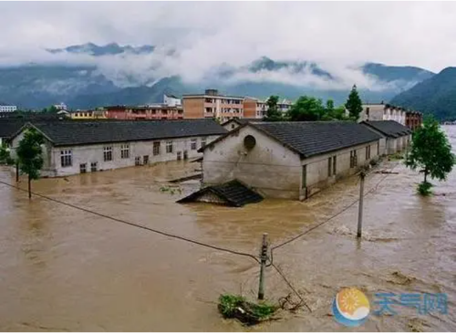

# 气候与自然灾害
### 一、气候分布
影响气候的因素：纬度、大气环流、海陆位置、地形地势、洋流影响  
(纬度：纬度越低，受到太阳照射越多，大地吸收的热能越多，也就越热  
大气环流：  
海陆位置：海洋和陆地的比热不同，  
地形地势：高处不胜寒，越高温度越低  
洋流影响：海洋的水是会移动的，也有温度的，温暖的海水和寒冷的海水交换，也会对地球各地的气候有影响，比如经典的厄尔尼诺现象
)

  
图上的五带还可以细分（热带、亚热带、温带、亚寒带、寒带），而中国大部分国土处于亚热带和温带上。  

### 二、风的形成
大气环流和洋流都受风的影响。
影响气候的最主要因素是它的能量来源，地球上最主要的能量来源是太阳，地球上的一切活动都和太阳息息相关。  
- 低气压  
地球是圆的，太阳光在照射在不同位置时，地面接受到的能量都不相同。低纬度地区比高纬度地区热许多，低纬度地区的空气因为高温的影响，体积膨胀，密度下降，变得比较轻，就会向上飘，对地表造成的压力较小，这是所谓的低气压。
- 高气压  
相反的，如果是低温的空气，体积缩小，密度增加，变得比较重，会向下沉，称之为高气压。  
气压的差异，会造成空气的流动，空气从高气压流向低气压，就是所谓的风。而风的形成，影响着世界各地的气候，也影响着每个地方，不同的气候和生态。    
- 风向  
另外，受到地球自转的影响，风向会改变，在北半球，从高压吹到低压，会朝着右边偏，所以从高压挤出来的风，会向右边绕，也就是顺时针，而低气压的风是逆时针方向的。  
热带雨林是怎么来的呢？赤道周围温度高气压低，大量上升气流会让空气借由上升的过程冷却降雨，因此赤道附近全年降雨量充沛。    
而继续的上升气流会在更高的空中，一边移动一边冷却，最后在纬度30度附近下降，下降气流会让空气温度变高变干燥（云的形成，上升气流带去的水蒸气才会凝结成云）下降气流会抑制云的产生，没有云的遮挡，所以太阳直射地面，温度升高，没有云也无法产生雨。因此地球上大部分的沙漠都在这个区域，比如世界上最大的沙漠，撒哈拉沙漠。  
下降气流下降到地表之后会向两旁吹送，加上地球自转的影响，让北半球的低纬度地区，一年四季都吹东北风，称为东北信风带。而中纬度地区则形成西风带，在西风带和东北信风带中间则是无风带。  

### 三、季风的形成
陆地比热比较小，海洋比热比较大，陆地吸热散热都比较快，海洋吸热散热都比较慢，吸热快温度较高，吸温慢温度较低，所以被太阳照射后的陆地空气膨胀，会往上排，而海洋的空气相对陆地来说是冷缩的，在陆地和海洋之间就形成了一种对流，从而产生季风。  

### 四、洋流
太阳带来的热在地表形成了各种不同的风，影响陆地上的生态，也影响了广大的海洋，再加上各地海域的温差，盐度差，高度差，高度差以及地球的自转，让海洋会产生稳定的大规模环流，那就是环流。    
洋流分为暖洋流和冷洋流，从低纬度到高纬度流向的海水，是暖洋流，从高纬度到低纬度流向的海水，是冷洋流，称为寒流。

冷洋流流经的地方，由于水温较低，蒸发较弱，所以空气干燥。有些冷洋流带有丰富的营养物质，流经的地方可能形成渔场。比如秘鲁寒流流经的东南太平洋就形成了丰富的渔场。  
但是随着人类生产生活的发展，一切自然规律正在改变。温室效应造成了全球变暖。一旦天气出现非同寻常的变化，就会对人类造成冲击。圣婴现象，就是这样一个例子。
### 五、圣婴现象
圣婴现象是因为太平洋海流与大气间的循环异常所产生的短期气候变化。  
正常状态是这样：西太平洋赤道附近海水表面温度高，为低压带及上升气流区。而东太平洋赤道附近海水表面温度低，是高压带及下降气流区。沿着赤道，低层的气流由东往西移动，而高层的气流，由西往东移动，形成沃克环流。  
同时在海底也有另一种循环。东太平洋和秘鲁外海表层海水受到赤道底层东风吹送，向西太平洋缓缓流动，较底层冰冷海水则涌升补充，整个环流最后遇到陆地下沉。这样的循环为澳洲，印尼，东南亚一带带来丰沛的降雨。而靠近秘鲁的东太平洋，因为表层海水常年维持在低温的状态，蒸散作用小，导致秘鲁沿海缺乏水汽，成为干旱的沙漠。  
以上这种正常的现象叫做拉尼娜。

但科学家观测到，每隔几年，秘鲁沿海海水温度会上升，整个循环产生变化。此时沃克环流减弱甚至相反，这就是所谓的圣婴现象。  
当圣婴发生的时候，赤道的东风变弱，吹送海水的力量减弱，温暖的海水往东边蔓延，让印尼和澳洲一带的雨量下降，造成干旱。同时，因为吹送减弱的关系，从海底涌升的冰冷海水也会减少，让秘鲁一带的海水温度上升，雨量提高，造成洪水。也会造成秘鲁渔场动物的减少。这个现象最早由秘鲁的渔民在圣诞节，也就是耶稣诞辰前夕被发现，所以叫做圣婴现象。
### 六、厄尔尼诺
圣婴现象的别名？ 
圣婴现象也叫做厄尔尼诺现象。厄尔尼诺现象会伴随巨大的能量转移。  
1997年的厄尔尼诺给东太平洋带去了35兆兆亿焦耳的能量（35后面21个0J），相当于16万个炸弹，或地球上所有人类一年能耗的一百倍。当这股巨能转移到产生天气气象的大气层中时，它就会对整个世界造成影响。  
1997-1998北半球冬天的厄尔尼诺现象是有史以来最强的，加州，秘鲁的强降水造成了数百人死亡，使上千人无家可归。印尼遭遇了严重的干旱，蒙古的气温达到了华氏108度，厄尔尼诺会让大西洋飓风减少，但是太平洋的风暴却会增多。1997年的飓风“宝林”一天内在西墨西哥下了27英寸(~68厘米)深的雨。而在我国，98年也受厄尔尼诺的影响，发生了一场特大洪水。

### 七、蝴蝶效应与厄尔尼诺
那么可以预测厄尔尼诺吗？ 不可以。  
厄尔尼诺在每2-7年间，都有可能发生，有时候却不会发生，可以说是没什么周期性的。预测厄尔尼诺很难，甚至不可能。  
大家有没有听过——蝴蝶效应。
在1961年，气象学家 爱德华.劳伦兹在用计算机模拟天气变化，为了重现之前的结果，他再次输入变量，按下开始键，可结果却与第一次大相径庭。劳伦兹检查发现，原来他不小心打错了一个变量，本来应该输0.56127，却漏掉了最后三个小数位，就这么一个错误，仅仅万分之一的区别，却让计算结果大相径庭。混沌理论由此产生。  
劳伦兹偶然发现了，就算我们的计算系统再先进，还是无法准确预测几天后的天气的原因，初始参数再微小的变化都会导致完全不同的实验结果。想要预测的时间越长，那些微小的不确定性就被相应放大。  
劳伦兹由此发出了惊世一问，一只蝴蝶在巴西微微振翅，是否会掀起德克萨斯州的龙卷风？这就是所谓的 “蝴蝶效应” 并不是真的指蝴蝶扇翅会引起飓风，而是说微小的改变最终会产生巨大的影响。  
大气层是超级复杂的系统

这些巨大的流体由无数个独立的粒子组成，每个粒子都受阳光，温度，气压，风，湿度等的影响。

这些粒子遵循物理法则，有解释这些法则的方程，有强大运算能力的电脑。可就算我们能够测出大气中每个粒子每时每刻的动向，但每一步测量都会有微小的不确定性。
  

劳伦兹的混沌理论告诉我们，一旦过了几天，就算是一个星期，这些不确定性就会导致预测结果与随便瞎猜差不多了。

不确定性是我们所在的宇宙固有的特性，也许我们能够预测到明天的天气状况，但关于厄尔尼诺，只知道它会让天气变得一团糟。 
### 八、水循环与气象灾害
地球上的水分布非常不均匀，约有97%的水是海水，2%以冰山或冰川形式存在，另外1%的河川、湖泊、地下水才是我们能够直接使用的水。为什么水不会枯竭呢？我们知道太阳带来的光和热让海水蒸发，在空中凝结生云，风把云和水汽吹送到陆地，遇到抬升作用，形成降雨，一部分的水渗入地下，形成地下水，剩下的水才会汇聚形成河流，最后流入大海。  
全球暖化，气象变迁，加快水汽的凝结，带来了暴雨。于是洪水的强度和频率都将增加。  
暖化效应下，会让地面的水迅速蒸发，干旱的次数也将逐渐增加。随着人类的发展，循环正在发生改变。  

### 九、土壤液化与地层下陷
由于地底砂石岩层颗粒大小不同，较上方颗粒较大，有空隙，形成了含水层，再往下颗粒小，页岩会形成阻水层。下渗的雨水就会流到含水层，形成地下水。  
地下水和地面水是共通的，两者互相调节。地下水可以在旱季时补充河流和湖泊，雨季来临时，又可以吸收大量雨水，储存在地层之中。

而且地下水经过地层的层层过滤，变得比较干净，是非常好的可用水资源。  但是如果我们过度的使用地下水，超过了大自然所补充的水量，会在抽取之后形成空隙，在上层压力的作用下，泥沙颗粒会越来越紧密，就会造成地层下陷，在大雨来临之时，就容易造成淹水后难以将积水清除。比如台湾八八年的水灾数月后都未褪去，台湾虽然降水很多，但是因为台湾地形地势的问题，台湾中间高，四周低，河流大多湍急，而且台湾的河流都是直接就流向海里，周围没有邻地，供水只能自给自足，加上水资源的不合理利用、浪费，导致台湾屏东在八八年水灾之前的地层下陷。

所以我们要合理利用水资源，不浪费。
### 十、城市热岛效应
城市往往比农村、乡村热上许多。温室效应，已经让现在的温度比过去上升了许多。  
我们的城市比乡村少树，大部分土地都铺上了水泥，减弱了土壤水分的蒸散能力。  
城市人口众多、汽车排放、空调排放，城市都是钢筋混泥土，到了晚上，建筑会散发白天储存的热。  
城市密集的高楼大厦会阻挡风的流动。而且在高温的都市中心，会形成上升气流，会把郊区的风阻隔在城市上空。没有了风，热能，脏空气，水汽都会被困在城市里，城市因此不仅热，还闷，还湿，就像一个大蒸笼。  
### 那么怎么才能缓解这种情况呢？   
- 城市新建筑，绿色建筑，比如台湾成功大学的绿色建筑 
- 减少碳排放，碳排放增加是全球变暖的一个很重要的因素，现在有一个概念，叫“碳中和”
- 作为个人来说，就是在夏天的时候合理空调，绿色出行，合理利用资源。  
交通基本法则：建更多的道路只会让人们开更多车
