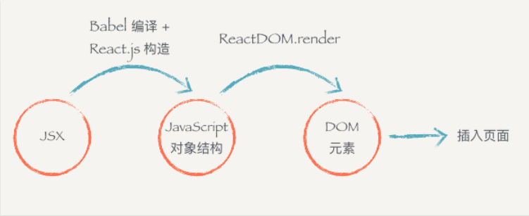
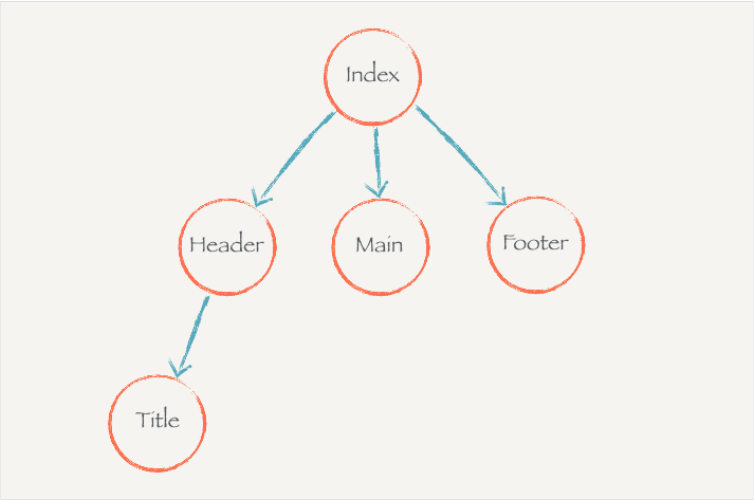

### 1. React.js基本环境安装
使用create-react-app来生成react所需要的工程目录
```javascript
npm install create-react-app -g
```
创建项目
```javascript
create-react-app hello-react
```
### 2. JSX
JSX原理：html和js都可以创建dom元素，但是用js代码写起来很长，结构看起来要不清晰，用html写就清晰很多，于是我们把将类似html结构的代码编译成js对象的过程交给react来做。jsx代码最终会被编译成javascript对象
- 从JSX到页面到底经过了怎样的过程？  
  

需要用外层元素包裹起来，如
```javascript
render () {
  return (
    <div>
      <div>第⼀个</div>
      <div>第⼆个</div>
    </div>
  )
}
```
可以插入表达式，{}中的可以是1+2，也可以是一个函数，也可以是条件表达式。总之，{}内可以放任何的js代码
```javascript
render () {
  const word = 'hello'
  return (
    <div>
      <div>你好啊，李银河{word}</div>
    </div>
  )
}
```
### 3. 组件的组合、嵌套和组件树
组件可以和组件一起使用，组件内部可以引用别的组件，从而构成了组件树  
在JSX中，自定义组件开头用大写字母，普通标签用小写字母  
  
### 4. 事件监听
在JSX书写的元素上使用 on+事件名 的方式去监听事件，如onClick、onKeyDown，事件名必须使用 驼峰命名法  
不可以在JSX中的组件元素上监听事件，只能在普通的html元素上  
react事件监听也有event对象
需要注意监听事件的this
### 5. 组件中的state和setState
state用于保存组件的状态变量
```javascript
constructor (props) {
  super(props) this.state = {
    name: 'Tomy',
    isLiked: false
  }
}
handleClickOnLikeButton () {
  this.setState({ isLiked: !this.state.isLiked })
}
```
setState 传递参数  
setState方法由父类Component提供，调用这个方法时，react会去更新state中的状态，再调用react的render方法，将最新的dom渲染到页面上。  
注意点：setState并不会马上更新状态，而是把状态放到队列中，稍后再更新(内部代码应是异步执行的)  
```javascript
handleClickOnLikeButton () {
  // 异步更新
  console.log(this.state.isLiked) //刚开始是false
  this.setState({ isLiked: !this.state.isLiked }) //变更为true
  console.log(this.state.isLiked) //打印仍为false
}
```  
setState可以接受对象作为参数，接受对象时，只需要传递需要更新的状态就可以了。  
```javascript
handleClickOnLikeButton () {
  // 传递对象
  // 之前没有定义count
  this.setState({ count: 0 }) // => this.state.count 还是 undefined
  this.setState({ count: this.state.count + 1}) // => undefined + 1 = NaN
  this.setState({ count: this.state.count + 2}) // => NaN + 2 = NaN
}
```  
也可以接受函数作为参数，传递函数时，react会把上一个setState更新的状态传递到函数里，可以使用该结果进行操作运算，然后返回一个对象作为更新状态  
```javascript
handleClickOnLikeButton () {
  // 传递函数
  this.setState((prevState) => {
    return { count: 0 } 
  })
  this.setState((prevState) => {
    return { count: prevState.count + 1}
    // 上⼀个 setState 的返回是 count 为 0
  })
  this.setState((prevState) => {
    return { count: prevState.count + 2 }
  // 上⼀个 setState 的返回是 count 为 1
  // 最后的结果是 this.state.count 为 3
  })
}
```
### 6. 配置组件的props 
props和vue的props差不多，都是传递给组件的数据，使用的时候，直接在组件上使用标签属性那样使用  
默认配置 defaultProps，在vue中是直接写在props里
### 7. state 和 props的对比
state是用于保存组件内的状态，作用于局部，只能被自己控制，使用setState会让所有使用该组件的地方都状态变得一致  
props是让使用该组件的父组件传递参数进去，组件内部无法变更和修改props，每个地方使用该组件的地方需要不同的状态就可以传递参数来实现
- 无状态组件：没有使用state  
- 有状态组件：使用了state
### 8. 渲染列表数据
可以用map写，需要key
```javascript
const users = [
  {name: '土豆', age: 21},
  {name: '地瓜', age: 20},
  {name: '番茄', age: 27},
  {name: '芒果', age: 18}
]
class User extends React.Component{
  render() {
    const { user } = this.props
    return (
      <div>
        <div>姓名：{user.name}</div>
        <div>年龄：{user.age}</div>
      </div>
    )
  }
}
class Index extends React.Component{
  render() {
    return(
      <div>
        {users.map((user, idnex) => <User user={user} key={index}/>)}
      </div>
    )
  }
}
ReactDOM.render(
  <Index />,
  document.getElementById('root')
)
```
### 9. 规范
如果文件导出是一个类，文件名就用大写大头  
在react中用户可输入的组件被叫做受控组件
### 10. 前端应用状态管理
状态提升：当某个状态被多个组件依赖或影响时，就该把状态提升到这些组件最近的公共组件中去管理，用props来传递数据或函数，来管理这种依赖或附着关系。但是状态依赖层级多了时，就不适合这样去做，后面会引入redux
### 11. 挂载阶段的生命周期
组件的挂载：React.js将组件渲染，并且将构造DOM元素然后塞入页面的过程。
```javascript
constructor()
componentWillMount()
// 对应vue组件生命周期的beforeCreate()
render()
componentDidMount()
// 对应vue组件生命周期的created()
// 然后构造DOM元素
// ...
// 即将从页面删除
componentWillUnmount()
// 从页面删除
```
